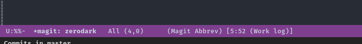

Zerodark Emacs theme 
===============================================================================

A dark theme for [Emacs](https://www.gnu.org/software/emacs/), inspired from [Niflheim](https://github.com/niflheim-theme/emacs) and [One Dark](https://github.com/atom/one-dark-syntax)

## Screenshots

### Elisp

### Magit

### Emails (notmuch)

### High contrast mode-line

The mode-line can use more contrasted colors, with
`zerodark-use-high-contrast-in-mode-line`:

### Mode-line format (optional)

When `zerodark-use-zerodark-mode-line-format` is `non-nil` (the default), a
custom mode-line-format is used:

### Note

The custom mode line provided with `zerodark-theme` uses
the [all-the-icons](https://github.com/domtronn/all-the-icons.el) package. The
package itself is installed along with `zerodark-theme`.

However, it is necessary to install the fonts in the `fonts` directory included
in `all-the-icons` repository as explained in its README:

> in order for the icons to work you will need to install the Resource Fonts
> included in this package, they are available in the fonts directory.

## Installation (with MELPA)

    M-x package-install RET zerodark-theme

Copyright 2015-2016 (C) Nicolas Petton
