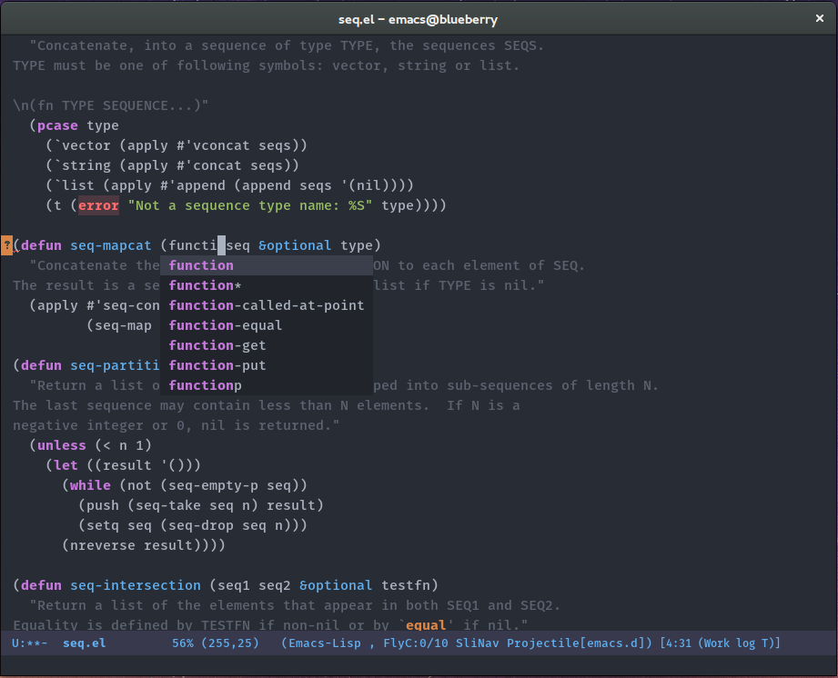
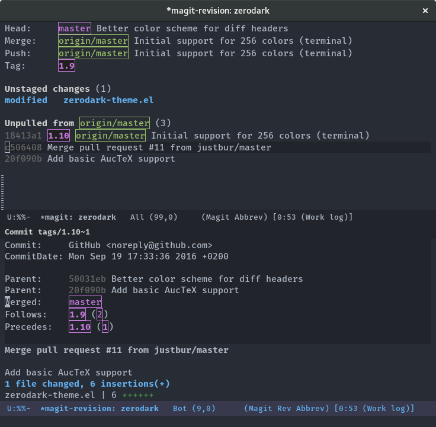
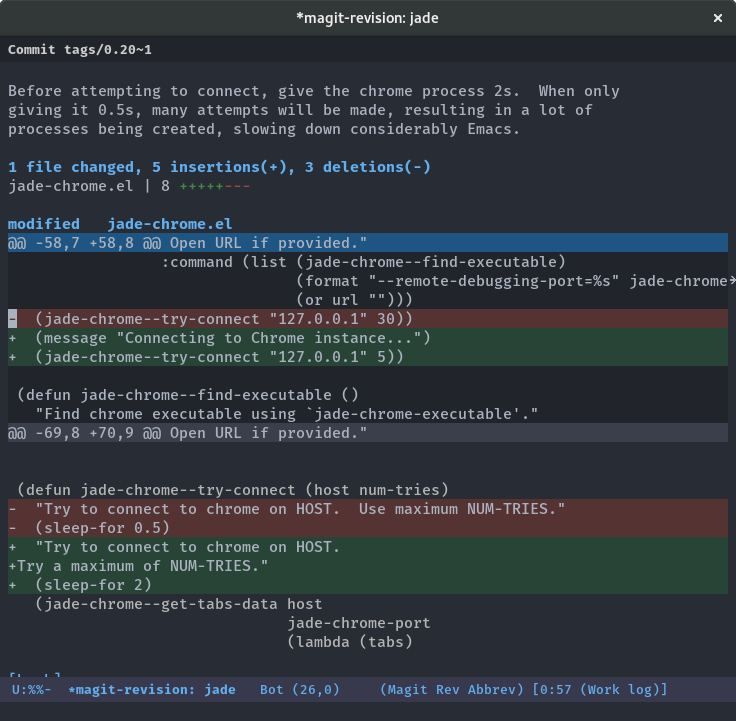
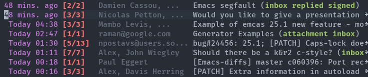
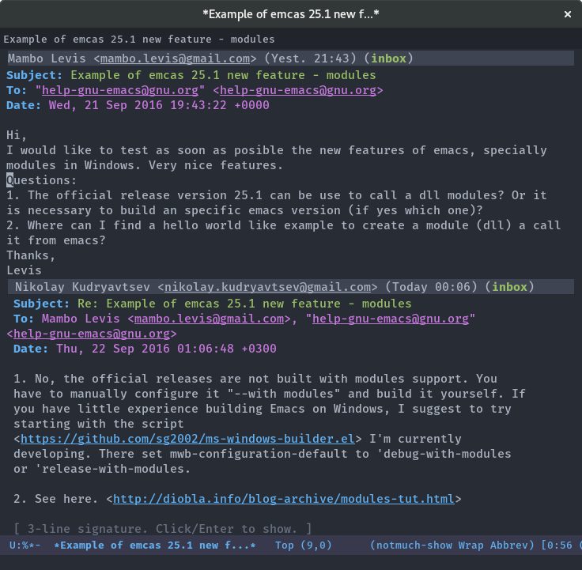
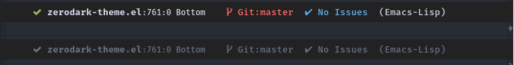
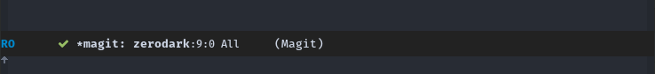

Zerodark Emacs theme 

===============================================================================

A dark theme for [Emacs](https://www.gnu.org/software/emacs/), inspired from [Niflheim](https://github.com/niflheim-theme/emacs) and [One Dark](https://github.com/atom/one-dark-syntax)

Repository mirrored with [petton.fr/git/nico/zerodark-theme](https://petton.fr/git/nico/zerodark-theme).

## Screenshots

### Elisp

### Magit

<!--  -->

<!-- ### Emails (notmuch) -->

<!--  -->
<!--  -->

### Mode-line format (optional)

Evaluate `zerodark-setup-modeline-format` to enable the custom mode-line-format:

### Note

The custom mode line provided with `zerodark-theme` uses
the [all-the-icons](https://github.com/domtronn/all-the-icons.el) package. The
package itself is installed along with `zerodark-theme`.

However, it is necessary to install the fonts in the `fonts` directory included
in `all-the-icons` repository as explained in its README:

> in order for the icons to work you will need to install the Resource Fonts
> included in this package, they are available in the fonts directory.

### Supported packages

Zerodark supports for many packages, including the following:

- ace-window
- anzu
- avy
- clojure-mode
- company-mode
- diff-hl
- ediff
- elfeed
- erc
- eshell
- flycheck
- helm
- hydra
- ido
- ivy
- jabber.el
- js2-mode
- ledger
- linum
- magit
- notmuch
- orgmode
- powerline
- show-paren
- visible-mark
- web-mode
- wgrep
- whitespace-mode

## Installation (with MELPA)

    M-x package-install RET zerodark-theme

Copyright 2015-2016 (C) Nicolas Petton
